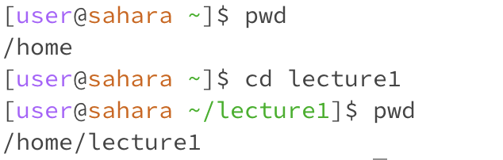
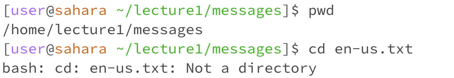
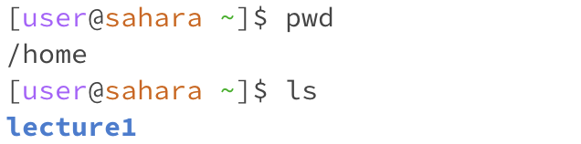
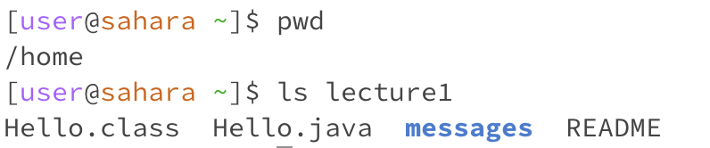
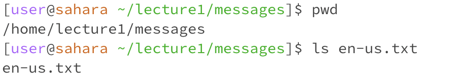
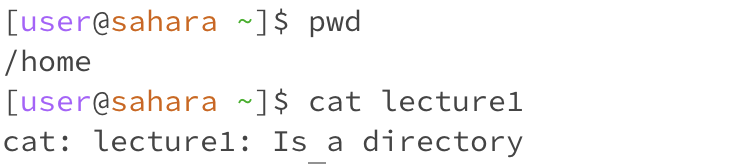
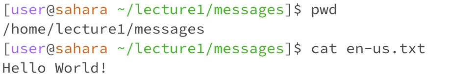

## Lab Report 1
> *Remote Access and FileSystem (Week 1)*

***Basic filesystem commands***:

IMPORTANT: 

For all the Command and Output, it uses `pwd` to show the working directory first.

**cd**: 
> "Change Directory" Used to switch the current working directory

1. With no arguments
   
   Command and Output:

   

   Current Working Directory: `/home`
   
   Error or Not: NO

   Reason:
   * No output, but the user is returned to `/home`.
   * Since there is no argument after `cd`, the directory returns to `home`.

   
2. With a path to a directory

   Command and Output:

   

   Current Working Directory: `/home`
   
   Error or Not: NO

   Reason:
   * No output, but the user is directed to `/home/lecture1` (shown by using `pwd` after the command.
   * Since the argument is a directory name and `cd` is used to switch directory, the directory is switched to `/home/lecture1`.

  
3. With a path to a file

   Command and Output:

   

   Current Working Directory: `/home/lecture1/messages`
   
   Error or Not: ERROR

   Reason:
   * The user cannot be directed to `/home/lecture1/messages/en-us.txt` because `/en-us.txt` is a text file. But `cd` is used to switch the directories but not files.

  
**ls**:
> "List" Used to list the files and folders the given path

1. With no arguments
   
   Command and Output:

   
   
   Current Working Directory: `/home`
   
   Error or Not: NO

   Reason:
   * `ls` prints out all the files and folders inside the current directory `/home`, which only has one directory `lecture1` in it.

   
2. With a path to a directory

   Command and Output:

   

   Current Working Directory: `/home`
   
   Error or Not: NO

   Reason:
   * `ls lecture1` prints out all the files and folders inside `/home/lecture1`, so all the files and directories are printed out.

  
3. With a path to a file

   Command and Output:

   
   
   Current Working Directory: `/home/lecture1/messages`
   
   Error or Not: NO

   Reason:
   * Since there is no files or folders in a text file `en-us.txt`，`ls` simply repeats the file name of it again. It could also consider as the only file in the given text file.

**cat**:
> "Concatenate" Used to print the contents of one or more files given by the paths

1. With no arguments
   
   Command and Output:
   
   
   
   Current Working Directory: `/home`
   
   Error or Not: NO

   Reason:
   * `cat` requires a file argument to display its contents in it. There is nothing to print out when no filename is given.
   * Therefore, it provides a scanner. Whatever typed in the scanner is repeated in the next line, and it could be ended by Ctrl'C.

     
2. With a path to a directory

   Command and Output:
  
   
   
   Current Working Directory: `/home`
   
   Error or Not: ERROR

   Reason:
   * `cat` requires a filename to display its contents. There is nothing to print out when just a directory is given since it's neither a file or a folder.
   * `cat` couldn't print the contents in a directory.

  
3. With a path to a file

   Command and Output:
     
   
   
   Current Working Directory: `/home/lecture1/messages`
   
   Error or Not: NO

   Reason:
   * Since `en-us.txt` is a text file, `cat` displays the contents in the given file `/home/lecture1/messages/en-us.txt`, which is one sentence `Hello World!`.
