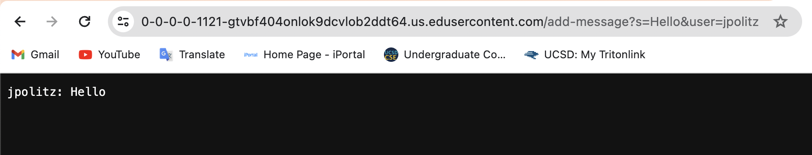
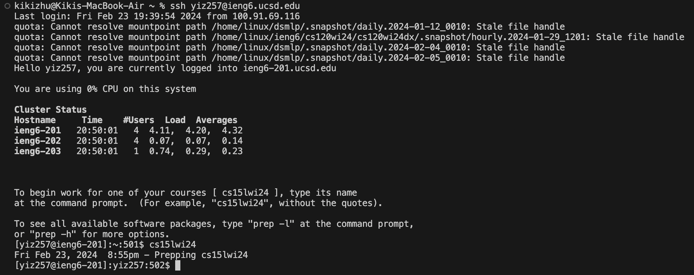
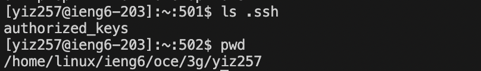

## Lab Report 2
> *URLs and Servers (Week 2) & VSCode and Your Local Machine (Week 3)*

<br />

**Part 1**: 
> write a web server called `ChatServer`

Create a folder named `ChatServer` with two files in it -- `ChatServer.java` and `Server.java`.
Write code in `ChatServer.java` and use the lab2 writeup as the reference for both.

`ChatServer.java`:
```
import java.io.IOException;
import java.net.URI;

class Handler implements URLHandler{
    String chatMessages = "";

    public String handleRequest(URI url){
        if (url.getPath().equals("/add-message")){
            String message = url.getQuery().split("&")[0].split("=")[1];
            String user = url.getQuery().split("&")[1].split("=")[1];

            if (message != null && user != null){
                String newMessage = user + ": " + message + "\n";
                chatMessages += newMessage;
                return chatMessages;
            } else 
                return "Invalid input! Please put both user and message.";
        }else
            return "404 Not Found!";
    }
}

public class ChatServer {
    public static void main(String[] args) throws IOException {
        if (args.length == 0){
            System.out.println("Missing port number! Try any number between 1024 to 49151");
            return;
        }
        int port = Integer.parseInt(args[0]);
        Server.start(port, new Handler());
    }
}
```

`Server.java`:
```
// Examples from https://dzone.com/articles/simple-http-server-in-java were useful references

import java.io.IOException;
import java.io.OutputStream;
import java.net.InetSocketAddress;
import java.net.URI;

import com.sun.net.httpserver.HttpExchange;
import com.sun.net.httpserver.HttpHandler;
import com.sun.net.httpserver.HttpServer;

interface URLHandler {
    String handleRequest(URI url);
}

class ServerHttpHandler implements HttpHandler {
    URLHandler handler;
    ServerHttpHandler(URLHandler handler) {
      this.handler = handler;
    }
    public void handle(final HttpExchange exchange) throws IOException {
        // form return body after being handled by program
        try {
            String ret = handler.handleRequest(exchange.getRequestURI());
            // form the return string and write it on the browser
            exchange.sendResponseHeaders(200, ret.getBytes().length);
            OutputStream os = exchange.getResponseBody();
            os.write(ret.getBytes());
            os.close();
        } catch(Exception e) {
            String response = e.toString();
            exchange.sendResponseHeaders(500, response.getBytes().length);
            OutputStream os = exchange.getResponseBody();
            os.write(response.getBytes());
            os.close();
        }
    }
}

public class Server {
    public static void start(int port, URLHandler handler) throws IOException {
        HttpServer server = HttpServer.create(new InetSocketAddress(port), 0);

        //create request entrypoint
        server.createContext("/", new ServerHttpHandler(handler));

        //start the server
        server.start();
        System.out.println("Server Started!");
    }
}
```
<br />
<br />
Two screenshots of using `/add-message`:

`/add-message?s=Hello&user=jpolitz`:



* **`Server.start(port, new Handler())`**:
  - Method: `start(int port, URLHandler handler)` in the `Server` class
  - Argument:
    - `port`: The port number parsed from the command-line arguments
    - `handler`: An instance of the `Handle` class that implements `URLHandler`
  - Relevant fields:
       - `chatMessages`: Initialized as an empty String `""`
  - Changes:
    - No change since the method call only initializes the server with the provided handler.
    
* **`Handler.handleRequest(URI url)`**:
  - Method: `handleRequest(URI url)` in the `Handler` class.
  - Argument:
    - `url`: The URI object representing the request `/add-message?s=Hello&user=jpolitz`
  - Relevant fields:
    - `message`: After `url.getQuery()`, `s=Hello&user=jpolitz` is splited by `"&"` and `"="`,
      it changes to the first second part of the string -- `"Hello"`.
    - `user`: It changes to the second second part of the string -- `"jpolitz"`.
    - `newMessage`: It makes the values above a complete string -- `"jpolitz: Hello\n"`.
    - `chatMessages`: After adding `newMessage`, it changes to `"jpolitz: Hello\n"`.


`/add-message?s=How are you&user=yash`:


* **`Server.start(port, new Handler())`**:
  - Method: `start(int port, URLHandler handler)` in the `Server` class
  - Argument:
    - `port`: The port number parsed from the command-line arguments
    - `handler`: An instance of the `Handle` class that implements `URLHandler`
  - Relevant fields:
       - `chatMessages`: Initially contained `"jpolitz: Hello\n"`
  - Changes:
    - No change since the method call only initializes the server with the provided handler.
    
* **`Handler.handleRequest(URI url)`**:
  - Method: `handleRequest(URI url)` in the `Handler` class.
  - Argument:
    - `url`: The URI object representing the request `/add-message?s=How%20are%20you&user=yash`
  - Relevant fields:
    - `message`: After `url.getQuery()`, `s=How%20are%20you&user=yash` is splited by `"&"` and `"="`,
      it changes to the first second part of the string -- `"How+are+you"`.
    - `user`: It changes to the second second part of the string -- `"yash"`.
    - `newMessage`: It makes the values above a complete string -- `"yash: How+are+you\n"`.
    - `chatMessages`: After adding `newMessage`, it changes to
      ```
      "jpolitz: Hello\n"
      "yash: How+are+you\n"
      ```

<br />

**Part 2**: 
> Using the command line, show with `ls`

* absolute path to the private key: `/User/kikizhu/id_rsa`
  
  
  
  <br />
* absolute path to the public key: `/home/linux/ieng6/oce/3g/yiz257/authorized_keys`
  
  
  
  <br />
  
* terminal interaction when logging into `ieng6` without password:
  

