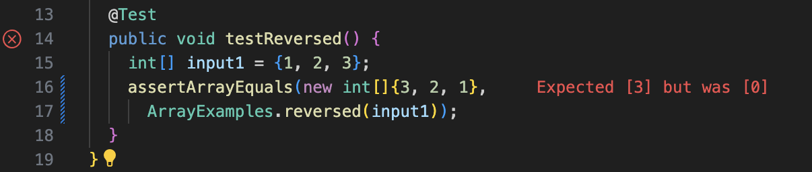
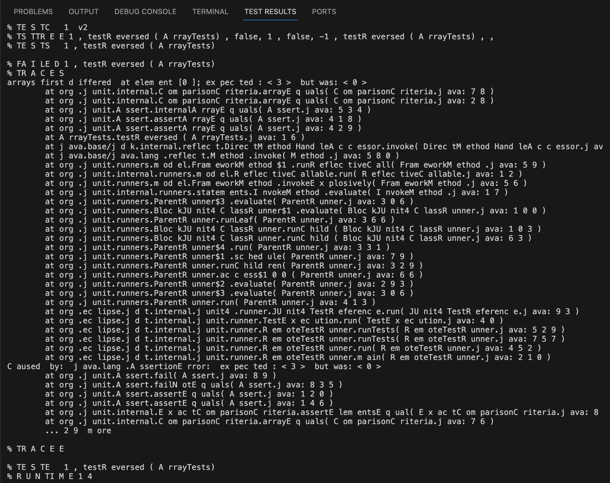
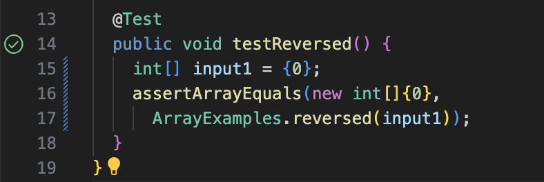
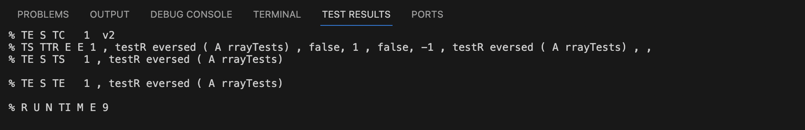

## Lab Report 3
> *Week 4 & Week 5*

<br />

**Part 1**: 
> pick a bug from Week 4's lab

- The method of returning a *new* array with all the elements of
  the input array in reversed order.

<br />

**The failure-inducing input for the program**:

```
@Test
  public void testReversed() {
    int[] input1 = {1, 2, 3};
    assertArrayEquals(new int[]{3, 2, 1}, 
      ArrayExamples.reversed(input1));
  }
```
<br />

**The output of running the test**:




<br />

**The input that doesn't induce a failure**:

```
@Test
  public void testReversed() {
    int[] input1 = {0, 0, 0};
    assertArrayEquals(new int[]{0, 0, 0}, 
      ArrayExamples.reversed(input1));
  }
```

<br />

**The output of running the test**:





<br />

**The before-and-after code change required to fix**:

BEFORE:

```
static int[] reversed(int[] arr) {
    int[] newArray = new int[arr.length];
    for(int i = 0; i < arr.length; i += 1) {
      arr[i] = newArray[arr.length - i - 1];
    }
    return arr;
  }
```
<br />

AFTER:

```
static int[] reversed(int[] arr) {
    int[] newArr = new int[arr.length];
    for(int i = 0; i < arr.length; i += 1) {
      newArr[i] = arr[arr.length - i - 1];
    }
    return newArr; 
    }
```
<br />
DESCRIPTION:

- The ***bug*** in the "before" code is that it just used the for loop to get the element in the creared `newArray` in a reverse order. But `newArray` actully only contains the same number of elements of `0` since it's uninitialized with the default value. Then `arr` would only have `0`. It also modifies the original array `arr`.
- The ***fix*** in the "after" code is that it created a new array `newArr` and assigned the element in `arr` to it in a reverse order, then returning the `newArr`. This also avoid modifying the original array `arr`.

<br />

**Part 2**: 
> choose one of the researching commands `less`, `find` and `grep`

- The command `find` and four command-line options `-name`, `-size`, `-type`, and `-exec`

<br />

1. `-name`: search by the given filename

- Example 1:
  - This commnad searches for all the files in the `911report` directory ending with `.txt`, useful in displaying all the specified type of files (text files here) in the given directory.
  - Command:
    ```
    find ./technical/911report -name "*.txt"
    ```
    
  - Output:

    ```
    kikizhu@Kikis-MacBook-Air docsearch % find ./technical/911report -name "*.txt"
    ./technical/911report/chapter-13.4.txt
    ./technical/911report/chapter-13.5.txt
    ./technical/911report/chapter-13.1.txt
    ./technical/911report/chapter-13.2.txt
    ./technical/911report/chapter-13.3.txt
    ./technical/911report/chapter-3.txt
    ./technical/911report/chapter-2.txt
    ./technical/911report/chapter-1.txt
    ./technical/911report/chapter-5.txt
    ./technical/911report/chapter-6.txt
    ./technical/911report/chapter-7.txt
    ./technical/911report/chapter-9.txt
    ./technical/911report/chapter-8.txt
    ./technical/911report/preface.txt
    ./technical/911report/chapter-12.txt
    ./technical/911report/chapter-10.txt
    ./technical/911report/chapter-11.txt
    ```

<br />

- Example 2: 
  - This commnad searches for all the files in the `government` directory starting with the name `Session`, useful in displaying all the files starting with the given name in the given directory.
  - Command:
    ```
    find ./technical/government -name "Session*"
    ```
    
  - Output:

    ```
    kikizhu@Kikis-MacBook-Air docsearch % find ./technical/government -name "Session*"
    ./technical/government/Alcohol_Problems/Session2-PDF.txt
    ./technical/government/Alcohol_Problems/Session3-PDF.txt
    ./technical/government/Alcohol_Problems/Session4-PDF.txt
    ```
    
<br />

2. `-size`: search by the given filesize
- Example 1:
  - This commnad searches for all the files in the `911report` directory larger than 200KB, useful in displaying all the large files over the given size in the given directory.
  - Command:
    ```
    find ./technical/911report -size +200k
    ```
    
  - Output:

    ```
    kikizhu@Kikis-MacBook-Air docsearch % find ./technical/911report -size +200k
    ./technical/911report/chapter-13.4.txt
    ./technical/911report/chapter-13.5.txt
    ./technical/911report/chapter-3.txt
    ```

<br />

- Example 2: 
  - This commnad searches for all the files in the `911report` directory smaller than 50KB, useful in displaying all the small files below the given size in the given directory.
  - Command:
    ```
    find ./technical/911report -size -50k
    ```
    
  - Output:

    ```
    kikizhu@Kikis-MacBook-Air docsearch % find ./technical/911report -size -50k
    ./technical/911report
    ./technical/911report/preface.txt
    ./technical/911report/chapter-10.txt
    ```
    
<br />

3. `-type`: search by the given file type
- Example 1:
  - This commnad searches for all the directories in the `government` directory, useful in displaying all the specified types (directories here) in the given directory.
  - Command:
    ```
    find ./technical/government -type d
    ```
    
  - Output:

    ```
    kikizhu@Kikis-MacBook-Air docsearch % find ./technical/government -type d

    ./technical/government
    ./technical/government/About_LSC
    ./technical/government/Env_Prot_Agen
    ./technical/government/Alcohol_Problems
    ./technical/government/Gen_Account_Office
    ./technical/government/Post_Rate_Comm
    ./technical/government/Media
    ```

<br />

- Example 2: 
  - This commnad searches for all the regular files in the `Alcohol_Problems` directory belonging in `government` directory, useful in displaying all the specified types (files here) in the given directory.
  - Command:
    ```
    find ./technical/government/Alcohol_Problems -type f
    ```
    
  - Output:

    ```
    kikizhu@Kikis-MacBook-Air docsearch % find ./technical/government/Alcohol_Problems -type f

    ./technical/government/Alcohol_Problems/Session2-PDF.txt
    ./technical/government/Alcohol_Problems/Session3-PDF.txt
    ./technical/government/Alcohol_Problems/DraftRecom-PDF.txt
    ./technical/government/Alcohol_Problems/Session4-PDF.txt
    ```
    
<br />

4. `-exec`: execute command on found files
- Example 1:
  - This commnad prints the first six lines of all the text files in the `Alcohol_Problems` directory belonging to `government` directory, useful in quickly checking the specified lines of contents of the specified files in the given directory. 
  - Command:
    ```
    find ./technical/government/Alcohol_Problems -name "*.txt" -exec head -n 6 {} \;
    ```
    
  - Output:

    ```
    kikizhu@Kikis-MacBook-Air docsearch % find ./technical/government/Alcohol_Problems -name "*.txt" -exec head -n 6 {} \;


    Session 2.
    Identifying ED Patients with Alcohol Problems


    Session 3.
    Intervening with Alcohol Problems


    Discussion of
    Draft Recommendations


    Session 4.
    Implementing Preventive Interventions in
    ```

<br />

- Example 2: 
  - This commnad counts the number of lines of all the files in the `Alcohol_Problems` directory belonging to `government` directory, useful in quickly checking the code lines of the sepcified type of files in the given directory. 
  - Command:
    ```
    find ./technical/government/Alcohol_Problems -type f -exec wc -l {} \;
    ```
    
  - Output:

    ```
    kikizhu@Kikis-MacBook-Air docsearch % find ./technical/government/Alcohol_Problems -type f -exec wc -l {} \;
     637 ./technical/government/Alcohol_Problems/Session2-PDF.txt
    1679 ./technical/government/Alcohol_Problems/Session3-PDF.txt
     570 ./technical/government/Alcohol_Problems/DraftRecom-PDF.txt
    1375 ./technical/government/Alcohol_Problems/Session4-PDF.txt
    ```


> ***Citation***:
> 
> "find command-line options":
>
> https://man7.org/linux/man-pages/man1/find.1.html
> 
> ChatGPT:
>   - Prompt: "Could you tell me how the command `find` works with the four command-line options `-name`, `-size`, `-type`, and `-exec` and give me a few examples about each to explain?"
>   - Output Summary: It basically gave the definition of the command and with each command-line, and provided four examples for each command-line with the directories and files created by itself.
>   - Change: I read all the definition to understand what function each command-line has, and made specified experiement on each command-line in the `./technical` in the material from lab5. Then I found the most appropriate examples for each to explain.
