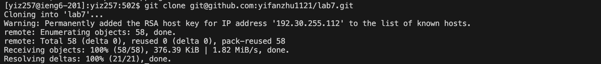
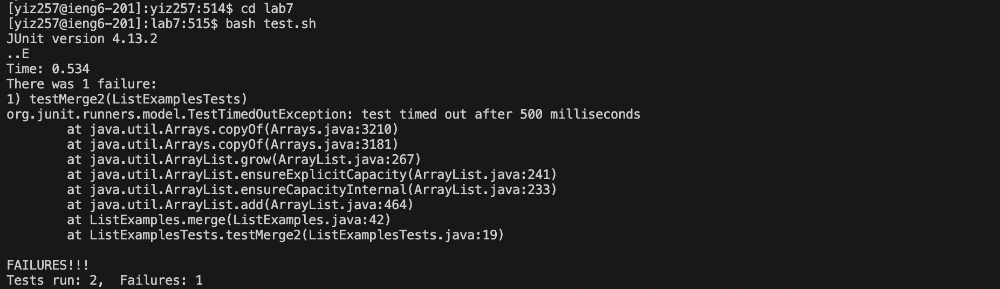

## Lab Report 4
> *Week 7*

 

**Step 1**: 
> Log into ieng6

Key Pressed: `ssh yiz257@ieng6.ucsd.edu <enter>`, `cse15lwi24 <enter>`

- The first command is to log in my ieng6 account by using the ssh key, so I typed it and access the account.
- The second command is to get in the course `cse15lwi24` by typing the course code, so I typed it and access the course.

 

 

**Step 2**: 
> Clone your fork of the repository from your Github account (using the `SSH` URL)

Key Pressed: `git clone <Ctrl-V> <enter>`

- The command is to clone the repo `lab7` by using the copied `SSH` URL `git@github.com:yifanzhu1121/lab7.git`, so I typed `git clone` and pasted it to clone the repo.

 

 

**Step 3**: 
> Run the tests, demonstrating that they fail

Key Pressed: `cd lab7 <enter>`, `bash test.sh <enter>`

- The first command is to direct to `lab7` to get access to `ListExamples.java` and `ListExamplesTests.java`, so I typed it and get into the directory `lab7`.
- The second command is to test it with `ListExamplesTests.java` by running the command lines in `test.sh` using `bash`, so I typed it and ran the test.

 

 

**Step 4**: 
> Edit the code file to fix the failing test

Key Pressed: `vim L<tab>.java <enter>`, `<43j> <esc> <e> <x> <i> <2> <esc> <:wq> <enter>`

- The first command is to get in the vim editing mode to fix the bug in `ListExamples.java` (filled by using `<tab>`, so I typed it and get in the editing mode.
- The second command is to get to the line needed to be fixed and edit it to change `index1` to `index2`.
  Press `<43j>` to repeat typing `<j>` for 43 times to get to Line 44, which is the problem line.
  Press `<esc>` to make sure it is in the Normal mode to input the following commands.
  Press `<e>` to get to the end of the current word `index1`, including the last character, so the cursor is at `1`.
  Press `<x>` to delete the character `1` under the cursor.
  Press `<i>` to get into the insert mode to add text `2`, then type `<2>` to change it to `index2`.
  Press `<esc>` again to exit the insert mode and get into the Normal mode to input the following commands.
  Press `<:wq>` to save the file `ListExamples.java` and exit.

 

 

**Step 5**: 
> Run the tests, demonstrating that they now succeed

Key Pressed: `ssh yiz257@ieng6.ucsd.edu <enter>`, `cse15lwi24 <enter>`

- The first command is to log in my ieng6 account by using the ssh key, so I typed it and access the account.
- The second command is to get in the course `cse15lwi24` by typing the course code, so I typed it and access the course.

 

 

**Step 6**: 
> Commit and push the resulting change to your Github account

Key Pressed: `ssh yiz257@ieng6.ucsd.edu <enter>`, `cse15lwi24 <enter>`

- The first command is to log in my ieng6 account by using the ssh key, so I typed it and access the account.
- The second command is to get in the course `cse15lwi24` by typing the course code, so I typed it and access the course.

 

 
