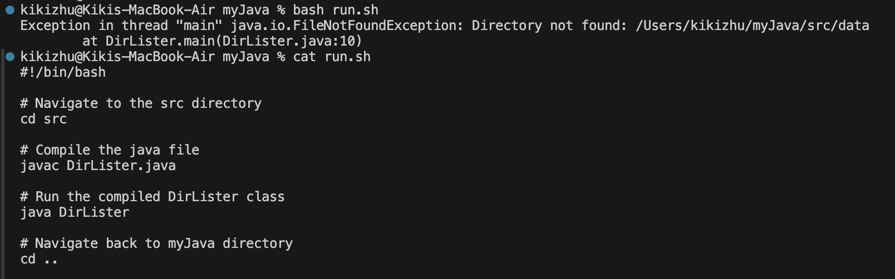
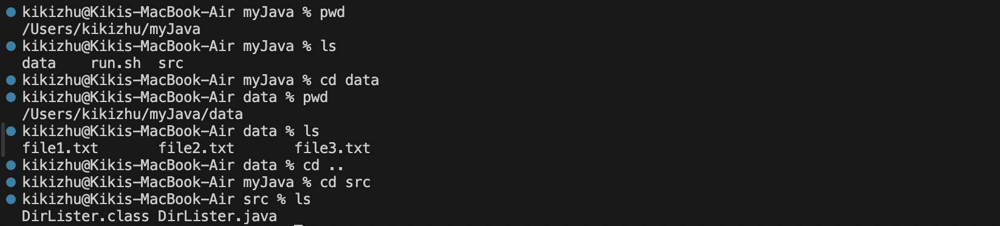

## Lab Report 5
> *Week 8 & Week 9*

<br />

**Part 1**: 

**Original Post**: 

Hi everyone,

I'm having some trouble with my Java program which is designed to list the contents of a specified directory. Despite the directory existing and containing files, my program throws a `FileNotFoundException`. Here's the error message and my bash script:



I thought the problem might be with the directory path I'm providing, but I've double-checked and it seems correct. The program is supposed to list files from `data` within the project folder `myJava`, but it's not finding the directory for some reason.

Thanks for helping.

<br />

**TA Response**: 

Hi,

The `FileNotFoundException` could indeed suggest a path issue. Try confirming the current working directory and the contents in it. And also think about if there is anything in your code leading to the unexpected directory. This will help you see if `data` is in the expected location relative to where your program is running.

<br />

**Follow-up Post**: 

Thanks! I tried running `pwd` and `ls` for both `src` (the one has the `DirLister.java`) and `myJava`, `data` does exist in `myJava`. But upon reviewing my code, I realized the issue lies in how I'm specifying the path to `data`. I assumed the working directory would be the project root `/home/user/myJava`, but it turns out the working directory was actually set to `src` where my Java file is located `/home/user/myJava/src`.



<br />

The issue was at line 6:
```
File dir = new File("data");
```


<br />

I modified the path to `data` to account for the actual working directory by changing the path to `../data`, which is one level up from the current `src`. And now it lists the files in `data` without throwing error message. Thanks for your help!


<br />


The change made at line 6:
```
File dir = new File("../data");
```


<br />

**Part 2**: 

I know it's quite a easy gain but I did learn a lot from the lab that taught us how to use the editor `vim`. I used to open a VScode and find the file in my labtop to open it there to edit, but using `vim` in the terminal make it much faster and more convenient. It's really interesting for me to figure out how to use those commands to efficiently edit some code in my java files. It helps a lot.
